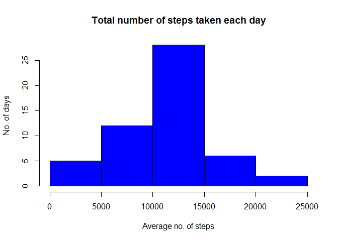
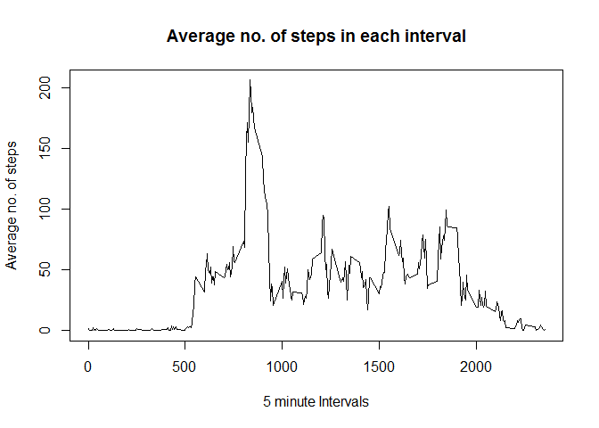
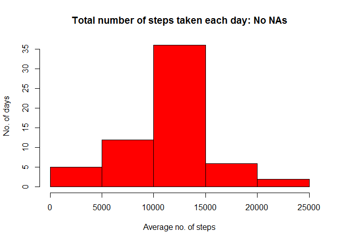
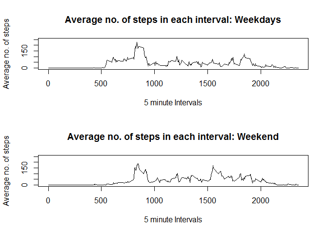

# Reproducible Research: Week 2 Assignment
by AC

#### Call the library

```r
library(knitr)
```

#### Download the file

```r
fil <- "https://d396qusza40orc.cloudfront.net/repdata%2Fdata%2Factivity.zip"
download.file(fil, destfile="./activity.zip")
```

#### Unzip the file

```r
unzip(zipfile="./activity.zip")
```

## Read the downloaded CSV file

```r
act <- read.csv("activity.csv")
```

#### Dimensions

```r
dim(act)
```

```
## [1] 17568     3
```

#### Variables present

```r
names(act)
```

```
## [1] "steps"    "date"     "interval"
```

#### Check classes of variables

```r
str(act)
```

```
## 'data.frame':	17568 obs. of  3 variables:
##  $ steps   : int  NA NA NA NA NA NA NA NA NA NA ...
##  $ date    : Factor w/ 61 levels "2012-10-01","2012-10-02",..: 1 1 1 1 1 1 1 1 1 1 ...
##  $ interval: int  0 5 10 15 20 25 30 35 40 45 ...
```

## Mean total steps per day (ignoring NAs)

```r
library(dplyr)
```

```
## 
## Attaching package: 'dplyr'
```

```
## The following objects are masked from 'package:stats':
## 
##     filter, lag
```

```
## The following objects are masked from 'package:base':
## 
##     intersect, setdiff, setequal, union
```

```r
perday <- group_by(act, date)
spd <- summarise(perday, tot=sum(steps))
```

### Histogram

```r
hist(spd$tot, col = "Blue", xlab = "Average no. of steps", ylab = "No. of days", main = "Total number of steps taken each day")
```

<!-- -->

## Mean & Median

```r
paste("Mean of steps per day: ",mean(spd$tot, na.rm = T))
```

```
## [1] "Mean of steps per day:  10766.1886792453"
```

```r
paste("Median of steps per day: ",median(spd$tot, na.rm = T))
```

```
## [1] "Median of steps per day:  10765"
```

#### Create table containing average no. of steps per interval

```r
gb <- group_by(act, interval)
avgint <- summarise(gb, avg=mean(steps, na.rm = T))
```

## Time Series plot

```r
plot(avgint$interval, avgint$avg, type="l", xlab = "5 minute Intervals", ylab = "Average no. of steps", main = "Average no. of steps in each interval")
```

<!-- -->

## Maximum avg steps across intervals

```r
paste("Interval with maximum average steps per day: ", avgint$interval[avgint$avg %in% max(avgint$avg)])
```

```
## [1] "Interval with maximum average steps per day:  835"
```

### Imputing missing values

```r
paste("No. of NAs in data set: ", nrow(act[act$steps %in% NA,]))
```

```
## [1] "No. of NAs in data set:  2304"
```

## Strategy to replace NA values: Replace with Mean for that Interval

```r
for(i in 1:nrow(act)){
    if(act$steps[i] %in% NA)
    {
        act$steps[i]=avgint$avg[act$interval[i] == avgint$interval]
    }
}
paste("No. of NAs after update: ", nrow(act[act$steps %in% NA,]))
```

```
## [1] "No. of NAs after update:  0"
```

Dimensions of updated data set

```r
dim(act)
```

```
## [1] 17568     3
```

## Histogram for total no. of steps per day

```r
perday <- group_by(act, date)
nona <- summarise(perday, total=sum(steps))
hist(nona$total, col = "Red", xlab = "Average no. of steps", ylab = "No. of days", main = "Total number of steps taken each day: No NAs")
```

<!-- -->

## Mean

```r
paste("Mean no. of steps per day: ", mean(nona$total))
```

```
## [1] "Mean no. of steps per day:  10766.1886792453"
```

## Median

```r
paste("Median no. of steps per day: ", median(nona$total))
```

```
## [1] "Median no. of steps per day:  10766.1886792453"
```

There is no significant change in values of mean and median despite the imputation.


#### Change date from factor to date data type

```r
act$date <- as.Date(act$date)
class(act$date)
```

```
## [1] "Date"
```

```r
day <- vector()
for(i in 1:nrow(act)){
    if(weekdays(act$date[i]) %in% "Monday"|weekdays(act$date[i]) %in% "Tuesday"|weekdays(act$date[i]) %in% "Wednesday"|weekdays(act$date[i]) %in% "Thurday"|weekdays(act$date[i]) %in% "Friday")
    {
        day[i] <- "Weekday"
    }
    else
    {
        day[i] <- "Weekend"
    }
}
act <- cbind(act,day)
act$day <- as.factor(act$day)
levels(act$day)
```

```
## [1] "Weekday" "Weekend"
```

#### Separating weekdays and weekend data

```r
wd <- act[act$day %in% "Weekday",]
we <- act[act$day %in% "Weekend",]
gbwd <- group_by(wd, interval)
gbwe <- group_by(we, interval)
avgwd <- summarise(gbwd, avg=mean(steps))
avgwe <- summarise(gbwe, avg=mean(steps))
```

## Panel Time Series Plots: Weekdays & Weekend

```r
par(mfrow=c(2,1))
plot(avgwd$interval, avgwd$avg, type="l", xlab = "5 minute Intervals", ylab = "Average no. of steps", main = "Average no. of steps in each interval: Weekdays", ylim = c(0,250))
plot(avgwe$interval, avgwe$avg, type="l", xlab = "5 minute Intervals", ylab = "Average no. of steps", main = "Average no. of steps in each interval: Weekend", ylim = c(0,250))
```

<!-- -->


